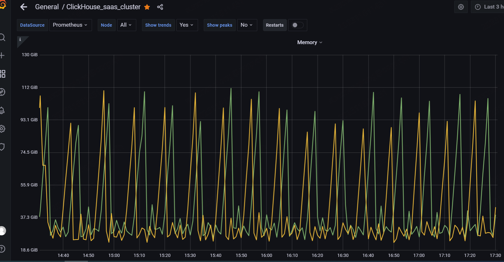
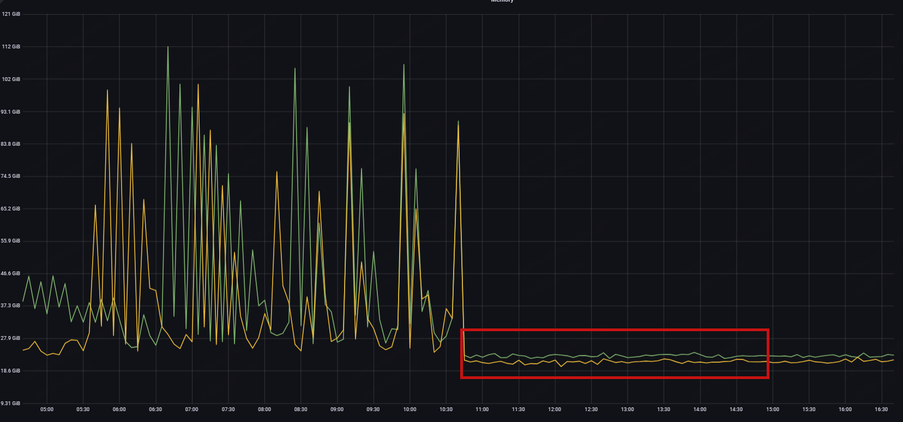

# 起因是因为看监控内存有规律的飙升：



# 排查过程：
1. 通过  `SHOW PROCESSLIST` 查看当前执行query 只有 写入，但是写入数据量不大且平稳
2. 查看日志没有异常日志
3. 通过查看字典，发现字典占用可忽略
4. 基于query_log和part_log的RAM使用情况回顾分析，定位到是后台 merger 导致
5. 通过查询 system.merges 定位到具体内存大户

经定位发现是一个聚合表后台合并造成内存激增，表结构如下：
```sql
CREATE TABLE ip_agg
(
    `version` UInt8,
    `host_name` String,
    `ip` String,
    `start_time` AggregateFunction(min, DateTime),
    `end_time` AggregateFunction(max, DateTime),
    `domain_uv` AggregateFunction(uniqExact, String),
    `count_pv` AggregateFunction(sum, UInt64)
)
ENGINE = AggregatingMergeTree()
PARTITION BY version
PRIMARY KEY (version, host_name, ip)
ORDER BY (version, host_name, ip)
SETTINGS index_granularity = 8192, merge_with_ttl_timeout = 7200, ttl_only_drop_parts = 1, use_minimalistic_part_header_in_zookeeper = 1;
```

由于 host_name 同一批数据写入中数值较多，作为主键会出现数据块过多的异常。因此，使用version=1作为主键。通过系统表查看当前运行的合并表明它使用了大量内存并且花费的时间太长。
```sql
SELECT
    table,
    elapsed,
    progress,
    num_parts,
    is_mutation,
    memory_usage,
    thread_id,
    merge_type,
    leftPad(formatReadableSize(sum(memory_usage)), 15, ' ') AS mem,
    sum(rows_read),
    sum(rows_written)
FROM system.mergesGROUP BY
    table,
    elapsed,
    progress,
    num_parts,
    is_mutation,
    memory_usage,
    thread_id,
    merge_type


Query id: fc8947fb-0b50-45bd-8a12-a624d76ac05b


┌─table────┬───────elapsed─┬───────────progress─┬─num_parts─┬─is_mutation─┬─memory_usage─┬─thread_id─┬─merge_type─┬─mem─────────────┬─sum(rows_read)─┬─sum(rows_written)─┐
│ ip_agg   │ 490.137469054 │ 0.9366010362309006 │         3 │           0 │  25305624747 │     66562 │ REGULAR    │       23.57 GiB │        1007616 │            598016 │
└──────────┴───────────────┴────────────────────┴───────────┴─────────────┴──────────────┴───────────┴────────────┴─────────────────┴────────────────┴───────────────────┘

```


经测试发现是因为 `domain_uv AggregateFunction(uniqExact, String)` ,  版本23.5 之后 引入了设置：`- merge_max_block_size_bytes` 来限制用于后台操作的内存量。
去除后监控恢复正常：




# 测试方式：

```sql
-- 创建基础数据
create table src(dim Int64, id String) Engine=MergeTree order by dim as select number%111111, toString(cityHash64(number)) from numbers(1e8);

-- 创建聚合表
create table trg(dim Int64, u AggregateFunction(uniqExact, String)) Engine=AggregatingMergeTree order by dim;

-- 生成聚合数据
insert into trg select dim, uniqExactState(id) from src group by dim;


-- 查询对比
-- 直接查询元数据 查看内存消耗
select uniqExact(id) from src;
┌─uniqExact(id)─┐
│     100000000 │
└───────────────┘
1 row in set. Elapsed: 9.819 sec. Processed 100.00 million rows, 2.84 GB (10.18 million rows/s., 289.21 MB/s.)
Peak memory usage: 6.03 GiB.

-- 通过查询汇总表查看消耗
select uniqExactMerge(u) from trg;
┌─uniqExactMerge(u)─┐
│         100000000 │
└───────────────────┘
1 row in set. Elapsed: 18.168 sec. Processed 111.11 thousand rows, 22.22 MB (6.12 thousand rows/s., 1.22 MB/s.)
Peak memory usage: 4.26 GiB.


-- 替换 uniqExact 测试效果
create table trgHLL(dim Int64, u AggregateFunction(uniqHLL12, String)) Engine=AggregatingMergeTree order by dim;
insert into trgHLL select dim, uniqHLL12State(id) from src group by dim;


-- 通过查询汇总表查看消耗
select uniqHLL12Merge(u) from trgHLL;
┌─uniqHLL12Merge(u)─┐
│         102184935 │
└───────────────────┘
1 row in set. Elapsed: 1.994 sec. Processed 111.11 thousand rows, 17.78 MB (55.72 thousand rows/s., 8.92 MB/s.)
Peak memory usage: 24.37 MiB.
```

通过发现 将 uniqExact 改用 uniqHLL12 近似值 会大大减少聚合消耗

[参考issu](https://github.com/ClickHouse/ClickHouse/issues/56193)


# 查看ch 内存使用情况：

[参考](https://kb.altinity.com/altinity-kb-setup-and-maintenance/altinity-kb-who-ate-my-memory/)

[系统表说明](https://clickhouse.com/docs/en/operations/system-tables/tables)


## 分析服务器文本日志
```bash
# grep MemoryTracker /var/log/clickhouse-server.log
# zgrep MemoryTracker /var/log/clickhouse-server.log.*.gz

2023.11.01 15:44:18.989648 [ 53544 ] {} <Debug> MemoryTracker: Peak memory usage Mutate/Merge: 4.02 MiB.
2023.11.01 15:44:19.055824 [ 53532 ] {} <Debug> MemoryTracker: Peak memory usage Mutate/Merge: 12.90 MiB.
2023.11.01 15:44:19.483354 [ 106272 ] {175919F83D6908DD} <Debug> MemoryTracker: Peak memory usage (for query): 300.67 MiB.
2023.11.01 15:44:19.483382 [ 106272 ] {} <Debug> MemoryTracker: Peak memory usage (for query): 300.67 MiB.
2023.11.01 15:44:19.633834 [ 53523 ] {} <Debug> MemoryTracker: Peak memory usage Mutate/Merge: 70.51 MiB.
2023.11.01 15:44:19.917591 [ 53536 ] {} <Debug> MemoryTracker: Peak memory usage Mutate/Merge: 77.59 MiB.
```


## Trace_log的回顾分析
```sql
WITH
    '2023-11-01 14:52:00' AS min_time,  
    '2023-11-01 15:01:00' AS max_time
SELECT
    trace_type,
    count(),
    topK(20)(query_id)
FROM system.trace_log
WHERE event_time BETWEEN min_time AND max_time
GROUP BY trace_type;

┌─trace_type─┬─count()─┬─topK(10)(query_id)──────────────────────────────────────────┐
│ Real       │    1070 │ ['175919B372271781','175919B372271784']                     │
│ CPU        │     211 │ ['175919B372271725','175919B37227163B','175919F83D68FF4A    │
│ Memory     │   79733 │ ['67ef430a-988e-439d-a1c7-2a8ac8ca7cef::1_0_14148285_105']  │
│ MemoryPeak │   79645 │ ['67ef430a-988e-439d-a1c7-2a8ac8ca7cef::1_0_14148285_105']  │
└────────────┴─────────┴─────────────────────────────────────────────────────────────┘
```


## 基于query_log和part_log的RAM使用情况回顾分析（显示峰值）
```sql
WITH
    now() - INTERVAL 10 MINUTE AS min_time,  
    now() AS max_time,
    INTERVAL 1 MINUTE as time_frame_size
SELECT
    toStartOfInterval(event_timestamp, time_frame_size) as timeframe,
    formatReadableSize(max(mem_overall)) as peak_ram,
    formatReadableSize(maxIf(mem_by_type, event_type='Insert'))     as inserts_ram,
    formatReadableSize(maxIf(mem_by_type, event_type='Select'))     as selects_ram,
    formatReadableSize(maxIf(mem_by_type, event_type='MergeParts')) as merge_ram,
    formatReadableSize(maxIf(mem_by_type, event_type='MutatePart')) as mutate_ram,
    formatReadableSize(maxIf(mem_by_type, event_type='Alter'))      as alter_ram,
    formatReadableSize(maxIf(mem_by_type, event_type='Create'))     as create_ram,
    formatReadableSize(maxIf(mem_by_type, event_type not IN ('Insert', 'Select', 'MergeParts','MutatePart', 'Alter', 'Create') )) as other_types_ram,
    groupUniqArrayIf(event_type, event_type not IN ('Insert', 'Select', 'MergeParts','MutatePart', 'Alter', 'Create') ) as other_types
FROM (
    SELECT
        toDateTime( toUInt32(ts) ) as event_timestamp,
        t as event_type,
        SUM(mem) OVER (PARTITION BY t ORDER BY ts) as mem_by_type,
        SUM(mem) OVER (ORDER BY ts) as mem_overall
    FROM
    (
        WITH arrayJoin([(toFloat64(event_time_microseconds) - (duration_ms / 1000), toInt64(peak_memory_usage)), (toFloat64(event_time_microseconds), -peak_memory_usage)]) AS data
        SELECT
        CAST(event_type,'LowCardinality(String)') as t,
        data.1 as ts,
        data.2 as mem
        FROM system.part_log
        WHERE event_time BETWEEN min_time AND max_time AND peak_memory_usage != 0
        UNION ALL
        WITH arrayJoin([(toFloat64(query_start_time_microseconds), toInt64(memory_usage)), (toFloat64(event_time_microseconds), -memory_usage)]) AS data
        SELECT
        query_kind,
        data.1 as ts,
        data.2 as mem
        FROM system.query_log
        WHERE event_time BETWEEN min_time AND max_time AND memory_usage != 0
        UNION ALL
        WITH
        arrayJoin([(toFloat64(event_time_microseconds) - (view_duration_ms / 1000), toInt64(peak_memory_usage)), (toFloat64(event_time_microseconds), -peak_memory_usage)]) AS data
        SELECT
        CAST(toString(view_type)||'View','LowCardinality(String)') as t,
        data.1 as ts,
        data.2 as mem
        FROM system.query_views_log
        WHERE event_time BETWEEN min_time AND max_time AND peak_memory_usage != 0
    )
)
GROUP BY timeframe
ORDER BY timeframe
FORMAT PrettyCompactMonoBlock;

┌───────────timeframe─┬─peak_ram──┬─inserts_ram─┬─selects_ram─┬─merge_ram──┬─mutate_ram─┬─alter_ram─┬─create_ram─┬─other_types_ram─┬─other_types──────────┐
│ 2023-11-01 14:46:00 │ 90.34 GiB │ 0.00 B      │ 0.00 B      │ 90.34 GiB  │ 0.00 B     │ 0.00 B    │ 0.00 B     │ 0.00 B          │ []                   │
│ 2023-11-01 14:51:00 │ 91.77 GiB │ 602.11 MiB  │ 0.00 B      │ 91.18 GiB  │ 0.00 B     │ 0.00 B    │ 0.00 B     │ 0.00 B          │ []                   │
│ 2023-11-01 14:52:00 │ 92.81 GiB │ 923.36 MiB  │ 29.62 MiB   │ 92.27 GiB  │ 0.00 B     │ 0.00 B    │ 0.00 B     │ 232.32 MiB      │ ['MaterializedView'] │
│ 2023-11-01 14:53:00 │ 92.77 GiB │ 924.18 MiB  │ 15.72 MiB   │ 91.89 GiB  │ 0.00 B     │ 0.00 B    │ 0.00 B     │ 169.05 MiB      │ ['MaterializedView'] │
│ 2023-11-01 14:54:00 │ 92.38 GiB │ 1.18 GiB    │ 17.58 MiB   │ 91.76 GiB  │ 0.00 B     │ 0.00 B    │ 0.00 B     │ 315.34 MiB      │ ['MaterializedView'] │
│ 2023-11-01 14:55:00 │ 93.41 GiB │ 902.86 MiB  │ 0.00 B      │ 92.82 GiB  │ 0.00 B     │ 0.00 B    │ 0.00 B     │ 237.18 MiB      │ ['MaterializedView'] │
│ 2023-11-01 14:56:00 │ 92.64 GiB │ 903.44 MiB  │ 1.01 KiB    │ 91.97 GiB  │ 0.00 B     │ 0.00 B    │ 0.00 B     │ 170.81 MiB      │ ['MaterializedView'] │
│ 2023-11-01 14:57:00 │ 93.12 GiB │ 624.75 MiB  │ 582.73 MiB  │ 92.53 GiB  │ 0.00 B     │ 0.00 B    │ 0.00 B     │ 172.14 MiB      │ ['MaterializedView'] │
│ 2023-11-01 14:58:00 │ 92.11 GiB │ 923.94 MiB  │ 0.00 B      │ 91.52 GiB  │ 0.00 B     │ 0.00 B    │ 0.00 B     │ 170.78 MiB      │ ['MaterializedView'] │
│ 2023-11-01 14:59:00 │ 2.59 GiB  │ 1.20 GiB    │ 22.85 MiB   │ 2.00 GiB   │ 0.00 B     │ 0.00 B    │ 0.00 B     │ 167.78 MiB      │ ['MaterializedView'] │
│ 2023-11-01 15:00:00 │ 2.80 GiB  │ 923.72 MiB  │ 125.04 KiB  │ 1.80 GiB   │ 0.00 B     │ 0.00 B    │ 0.00 B     │ 327.62 MiB      │ ['MaterializedView'] │
│ 2023-11-01 15:01:00 │ 1.13 GiB  │ 623.94 MiB  │ 0.00 B      │ 458.15 MiB │ 0.00 B     │ 0.00 B    │ 0.00 B     │ 166.48 MiB      │ ['MaterializedView'] │
└─────────────────────┴───────────┴─────────────┴─────────────┴────────────┴────────────┴───────────┴────────────┴─────────────────┴──────────────────────┘
```

## 查看当前合并情况
```sql
SELECT
    table,
    elapsed,
    progress,
    num_parts,
    is_mutation,
    memory_usage,
    thread_id,
    merge_type,
    leftPad(formatReadableSize(sum(memory_usage)), 15, ' ') AS mem
FROM system.merges
GROUP BY
    table,
    elapsed,
    progress,
    num_parts,
    is_mutation,
    memory_usage,
    thread_id,
    merge_type;


┌─table────────────┬──────elapsed─┬───────────progress─┬─num_parts─┬─is_mutation─┬─memory_usage─┬─thread_id─┬─merge_type─┬─mem─────────────┐
│ localAddress_agg │ 155.68046605 │ 0.4188053414040613 │         3 │           0 │  16273552047 │     66540 │ REGULAR    │       15.16 GiB │
│ cdns_entrance    │   4.15978324 │ 0.4515114049747421 │         8 │           0 │    262383614 │     66555 │ REGULAR    │      250.23 MiB │
└──────────────────┴──────────────┴────────────────────┴───────────┴─────────────┴──────────────┴───────────┴────────────┴─────────────────┘
```

## 查看字典内存占用
```sql
SELECT formatReadableSize(sum(bytes_allocated)) FROM system.dictionaries;SELECT
    name,
    status,
    formatReadableSize(sum(bytes_allocated))
FROM system.dictionaries
GROUP BY
    name,
    status
    WITH CUBE;


┌─name─────────────────────────────┬─status───────────────┬─formatReadableSize(sum(bytes_allocated))─┐
│ s_rule                           │ LOADED               │ 5.25 MiB                                 │
│ s_domain_source                  │ LOADED               │ 14.28 KiB                                │
└──────────────────────────────────┴──────────────────────┴──────────────────────────────────────────┘
┌─name─┬─status───────────────┬─formatReadableSize(sum(bytes_allocated))─┐
│      │ LOADED               │ 2.85 GiB                                 │
│      │ LOADED_AND_RELOADING │ 548.49 MiB                               │
│      │ NOT_LOADED           │ 0.00 B                                   │
└──────┴──────────────────────┴──────────────────────────────────────────┘
┌─name─┬─status─────┬─formatReadableSize(sum(bytes_allocated))─┐
│      │ NOT_LOADED │ 3.39 GiB                                 │
└──────┴────────────┴──────────────────────────────────────────┘
```


```sql
SELECT *, formatReadableSize(value)
FROM system.asynchronous_metrics
WHERE metric like '%Cach%' or metric like '%Mem%'
order by metric format PrettyCompactMonoBlock;

┌─metric───────────────────────┬─────────value─┬─formatReadableSize(value)─┐
│ CompiledExpressionCacheBytes │        114688 │ 112.00 KiB                │ 用于jit编译代码缓存的总字节数
│ CompiledExpressionCacheCount │            11 │ 11.00 B                   │ jit编译代码的缓存中的总条目
│ MMapCacheCells               │             0 │ 0.00 B                    │
│ MarkCacheBytes               │    5368594848 │ 5.00 GiB                  │
│ MarkCacheFiles               │        255908 │ 249.91 KiB                │
│ MemoryCode                   │     455340032 │ 434.25 MiB                │
│ MemoryDataAndStack           │ 1586482933760 │ 1.44 TiB                  │ 为使用堆栈和已分配内存而映射的虚拟内存量，以字节为单位。
│ MemoryResident               │   30506446848 │ 28.41 GiB                 │ 服务器进程使用的物理内存量，以字节为单位。
│ MemoryShared                 │      51171328 │ 48.80 MiB                 │
│ MemoryVirtual                │ 1588024283136 │ 1.44 TiB                  │ 服务器进程分配的虚拟地址空间的大小，以字节为单位。虚拟地址空间的大小通常比物理内存消耗大得多，因此不应该用作内存消耗的估计。
│ OSMemoryAvailable            │   96437780480 │ 89.81 GiB                 │
│ OSMemoryBuffers              │     686247936 │ 654.46 MiB                │
│ OSMemoryCached               │   32515981312 │ 30.28 GiB                 │
│ OSMemoryFreePlusCached       │   95570432000 │ 89.01 GiB                 │
│ OSMemoryFreeWithoutCached    │   63054450688 │ 58.72 GiB                 │
│ OSMemoryTotal                │  134692147200 │ 125.44 GiB                │
│ UncompressedCacheBytes       │    8589929533 │ 8.00 GiB                  │
│ UncompressedCacheCells       │         79984 │ 78.11 KiB                 │
└──────────────────────────────┴───────────────┴───────────────────────────┘
```

> [指标含义](https://clickhouse.com/docs/en/operations/system-tables/asynchronous_metrics)


## 查看内存表引擎
```sql
SELECT
    database,
    name,
    formatReadableSize(total_bytes)
FROM system.tables
WHERE engine IN ('Memory','Set','Join','Dictionary');
```
- 如果表将数据存储在磁盘上，则返回磁盘上已使用的空间（即压缩的）。
- 如果表将数据存储在内存中，则返回内存中已用字节的近似数。


```sql
SELECT
    event_time,
    metric,
    value,
    formatReadableSize(value)
FROM system.asynchronous_metric_log
WHERE (event_time > (now() - 600)) AND ((metric LIKE '%Cach%') OR (metric LIKE '%Mem%')) AND (value != 0)
ORDER BY
    value desc,
    metric ASC,
    event_time ASC
LIMIT 20
FORMAT PrettyCompactMonoBlock


┌──────────event_time─┬─metric─────────────┬─────────value─┬─formatReadableSize(value)─┐
│ 2023-11-01 15:37:11 │ MemoryVirtual      │ 1601160835072 │ 1.46 TiB                  │
│ 2023-11-01 15:37:10 │ MemoryVirtual      │ 1601144049664 │ 1.46 TiB                  │
│ 2023-11-01 15:37:09 │ MemoryVirtual      │ 1600691105792 │ 1.46 TiB                  │
│ 2023-11-01 15:37:08 │ MemoryVirtual      │ 1600422670336 │ 1.46 TiB                  │
│ 2023-11-01 15:37:07 │ MemoryVirtual      │ 1600036737024 │ 1.46 TiB                  │
│ 2023-11-01 15:37:06 │ MemoryVirtual      │ 1600003166208 │ 1.46 TiB                  │
│ 2023-11-01 15:37:11 │ MemoryDataAndStack │ 1599619485696 │ 1.45 TiB                  │
│ 2023-11-01 15:37:10 │ MemoryDataAndStack │ 1599602700288 │ 1.45 TiB                  │
│ 2023-11-01 15:37:05 │ MemoryVirtual      │ 1599499866112 │ 1.45 TiB                  │
│ 2023-11-01 15:37:09 │ MemoryDataAndStack │ 1599149756416 │ 1.45 TiB                  │
│ 2023-11-01 15:37:04 │ MemoryVirtual      │ 1599097212928 │ 1.45 TiB                  │
│ 2023-11-01 15:37:08 │ MemoryDataAndStack │ 1598881320960 │ 1.45 TiB                  │
│ 2023-11-01 15:37:03 │ MemoryVirtual      │ 1598879068160 │ 1.45 TiB                  │
│ 2023-11-01 15:37:07 │ MemoryDataAndStack │ 1598495387648 │ 1.45 TiB                  │
│ 2023-11-01 15:37:06 │ MemoryDataAndStack │ 1598461816832 │ 1.45 TiB                  │
│ 2023-11-01 15:37:02 │ MemoryVirtual      │ 1598426124288 │ 1.45 TiB                  │
│ 2023-11-01 15:37:01 │ MemoryVirtual      │ 1598157688832 │ 1.45 TiB                  │
│ 2023-11-01 15:37:05 │ MemoryDataAndStack │ 1597958516736 │ 1.45 TiB                  │
│ 2023-11-01 15:36:59 │ MemoryVirtual      │ 1597620817920 │ 1.45 TiB                  │
│ 2023-11-01 15:36:58 │ MemoryVirtual      │ 1597587247104 │ 1.45 TiB                  │
└─────────────────────┴────────────────────┴───────────────┴───────────────────────────┘
```


```sql
SELECT
    sumIf(data_uncompressed_bytes, part_type = 'InMemory') as memory_parts,
    formatReadableSize(sum(primary_key_bytes_in_memory)) AS primary_key_bytes_in_memory,
    formatReadableSize(sum(primary_key_bytes_in_memory_allocated)) AS primary_key_bytes_in_memory_allocated
FROM system.parts;


┌─memory_parts─┬─primary_key_bytes_in_memory─┬─primary_key_bytes_in_memory_allocated─┐
│            0 │ 484.55 MiB                  │ 946.17 MiB                            │
└──────────────┴─────────────────────────────┴───────────────────────────────────────┘
```


```sql
SELECT formatReadableSize(sum(memory_usage)) FROM system.merges;

┌─formatReadableSize(sum(memory_usage))─┐
│ 19.05 GiB                             │
└───────────────────────────────────────┘
```


## 查看进程使用
```sql
SELECT formatReadableSize(sum(memory_usage)) FROM system.processes;


SELECT
    initial_query_id,
    elapsed,
    formatReadableSize(memory_usage) as mem,
    formatReadableSize(peak_memory_usage) as peak_mem,
    query
FROM system.processes
ORDER BY peak_memory_usage DESC
LIMIT 10;


┌─initial_query_id─────────────────────┬─────elapsed─┬─mem───────┬─peak_mem───┬─query──────────────────────────┐
│ 175919F83D690C1A                     │ 1.164617791 │ 38.17 MiB │ 300.99 MiB │ INSERT INTO                    │
└──────────────────────────────────────────────────────────────────────────────────────────────────────────────┘
```


## 查看时间范围内请求使用情况
```sql
WITH
    toDateTime('2023-11-01 14:52:00') AS min_time,  
    toDateTime('2023-11-01 15:01:00') AS max_time
SELECT
    type,
    query_kind,
    event_time,
    initial_query_id,
    query_duration_ms,
    formatReadableSize(memory_usage),
    query_id
FROM system.query_log
WHERE (event_time >= min_time) AND (event_time <= max_time)
ORDER BY memory_usage DESC
LIMIT 10;


┌─type────────┬─query_kind─┬──────────event_time─┬─initial_query_id─┬─query_duration_ms─┬─formatReadableSize(memory_usage)─┬─query_id─────────┐
│ QueryFinish │ Select     │ 2023-11-01 14:57:55 │ 175919F83D68FF4A │              1174 │ 580.06 MiB                       │ 175919F83D68FF4A │
│ QueryFinish │ Insert     │ 2023-11-01 14:57:00 │ 175919B3722716E2 │              4032 │ 302.42 MiB                       │ 175919B3722716E2 │
│ QueryFinish │ Insert     │ 2023-11-01 14:57:35 │ 175919B37227170F │              2353 │ 302.37 MiB                       │ 175919B37227170F │
│ QueryFinish │ Insert     │ 2023-11-01 14:59:40 │ 175919B372271796 │              3521 │ 302.34 MiB                       │ 175919B372271796 │
│ QueryFinish │ Insert     │ 2023-11-01 14:56:25 │ 175919B3722716B8 │              3373 │ 302.33 MiB                       │ 175919B3722716B8 │
│ QueryFinish │ Insert     │ 2023-11-01 14:57:43 │ 175919B372271715 │              3317 │ 302.32 MiB                       │ 175919B372271715 │
│ QueryFinish │ Insert     │ 2023-11-01 14:56:57 │ 175919F83D68FF36 │              2443 │ 302.30 MiB                       │ 175919F83D68FF36 │
│ QueryFinish │ Insert     │ 2023-11-01 14:52:42 │ 175919B372271631 │              2336 │ 302.28 MiB                       │ 175919B372271631 │
│ QueryFinish │ Insert     │ 2023-11-01 14:52:45 │ 175919B372271633 │              2372 │ 302.27 MiB                       │ 175919B372271633 │
│ QueryFinish │ Insert     │ 2023-11-01 14:53:53 │ 175919F83D68FE9A │              2341 │ 302.19 MiB                       │ 175919F83D68FE9A │
└─────────────┴────────────┴─────────────────────┴──────────────────┴───────────────────┴──────────────────────────────────┴──────────────────┘
```


```sql
select formatReadableSize(sum(result_size)) FROM system.query_cache;
```


```bash
for i in `seq 1 600`; do clickhouse-client --empty_result_for_aggregation_by_empty_set=0 -q "select (select 'Merges: \
'||formatReadableSize(sum(memory_usage)) from system.merges), (select \
'Processes: '||formatReadableSize(sum(memory_usage)) from system.processes)";\
sleep 3;  done


Merges: 0.00 B  Processes: 36.79 MiB
Merges: 0.00 B  Processes: 22.89 KiB
Merges: 0.00 B  Processes: 37.70 MiB
Merges: 0.00 B  Processes: 84.62 MiB
Merges: 0.00 B  Processes: 46.73 MiB
```


```bash
echo "         Merges      Processes       PrimaryK       TempTabs          Dicts"; \
for i in `seq 1 600`; do clickhouse-client --empty_result_for_aggregation_by_empty_set=0  -q "select \
(select leftPad(formatReadableSize(sum(memory_usage)),15, ' ') from system.merges)||
(select leftPad(formatReadableSize(sum(memory_usage)),15, ' ') from system.processes)||
(select leftPad(formatReadableSize(sum(primary_key_bytes_in_memory_allocated)),15, ' ') from system.parts)|| \
(select leftPad(formatReadableSize(sum(total_bytes)),15, ' ') from system.tables \
WHERE engine IN ('Memory','Set','Join','Dictionary','MergeTree', 'ReplicatedAggregatingMergeTree', 'ReplicatedSummingMergeTree','ReplicatedMergeTree', 'MaterializedView'))||
(select leftPad(formatReadableSize(sum(bytes_allocated)),15, ' ') FROM system.dictionaries)
"; sleep 1;  done

```


